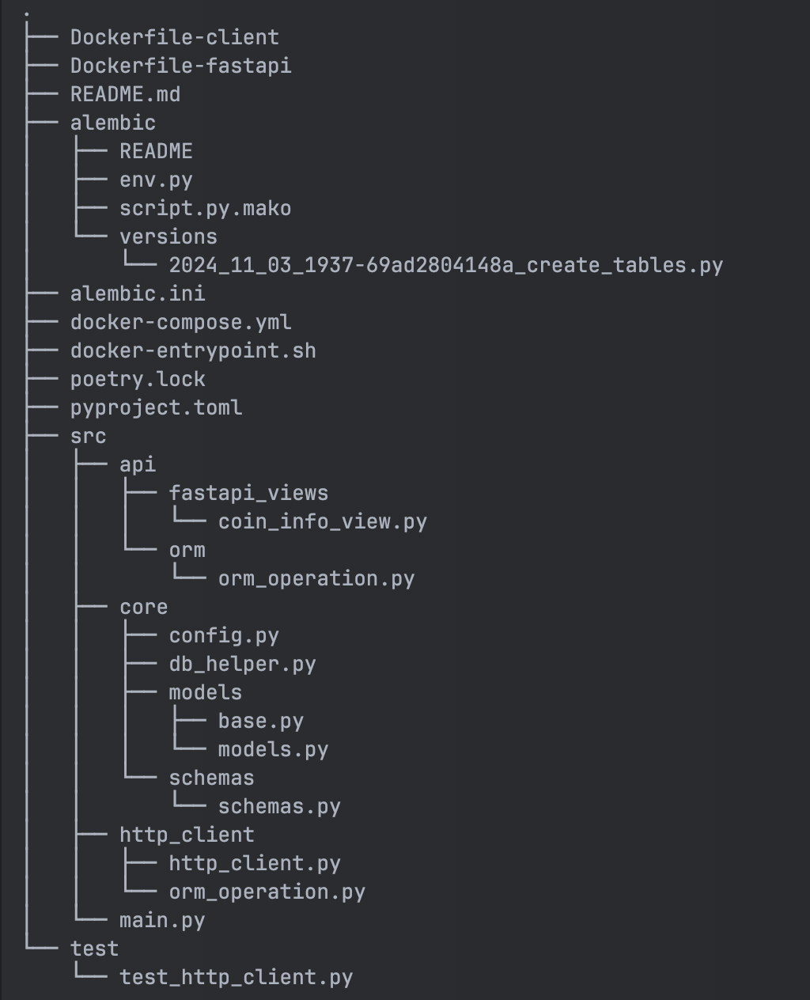

# Приложение "aiohttp_client"

Приложение состоит из двух приложений:
1. Первое это асинхронный клиент на aiohttp, который каждую минуту забирает
с биржи Deribit текущую цену btc_usd и eth_usd (index price валюты), после чего сохраняет в базу данных тикер валюты, 
текущую цену и время в UNIX timestamp.
2. Внешнее API для обработки сохраненных данных на FastAPI.

## Структура проекта:

1. Клиент, который собирает информацию с биржи находится по пути - src/http_client
2. Приложение на FastAPI расположено по пути - src/api

## В проекте были использованы такие библиотеки:

1. Python 3.12
2. FastApi
3. PostgreSQL
4. SqlAlchemy(async)
5. Pytest
6. Docker
7. Aiohttp

## Установка

1. Клонируйте репозиторий на вашу локальную машину:  
   git clone https://github.com/AndrewTarev/aiohttp_client.git

2. Добавьте файл .env, скопируйте туда шаблон .env.template и вставьте свои переменные

3. Запустите docker-compose командой:  
   docker compose build  
   docker compose up